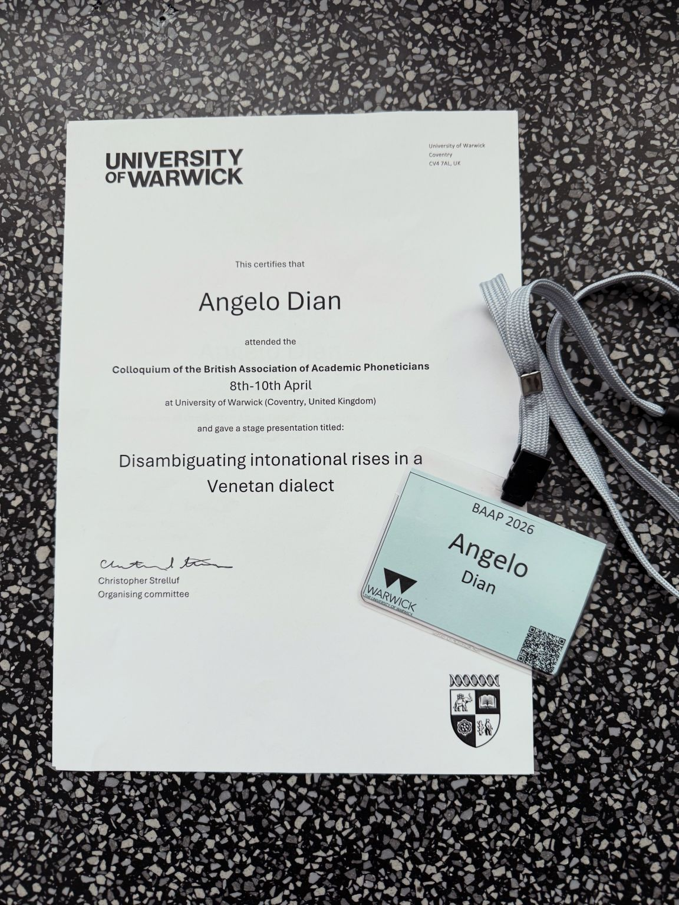
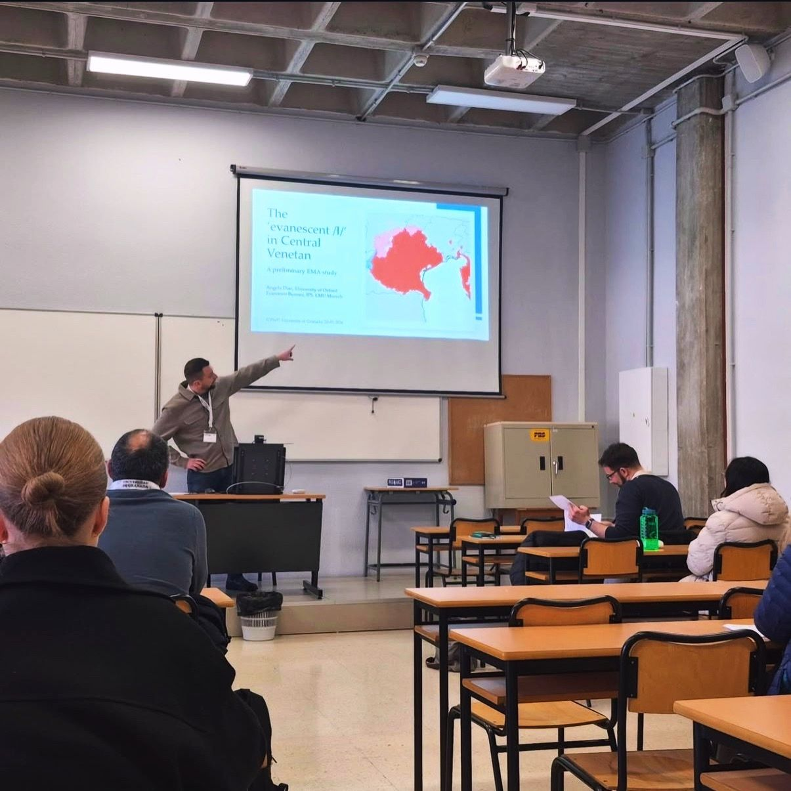

  <a href="/it/">🇮🇹 Italiano</a>

   
## Welcome to my academic homepage!  

I'm a phonetician, so I'll start my introduction with the phonetic transcription of my name the way I say it, transcribed using the <a href="https://www.internationalphoneticassociation.org/content/ipa-chart">IPA alphabet</a>: [ˈɐnd͡ʒelo ˈdjɐŋ]. [ˈdjɐŋ], one syllable, with a diphthong and a velar nasal at the end, is how people say my surname in the Veneto region of Italy, where I'm from. However, the rest of Italians tend to say [ˈdi.ɐn] (two syllables and an alveolar nasal at the end). Either pronunciation is fine to me :-)

I currently hold a post as a Postdoctoral Research Associate in Phonetics at the [University of Oxford](https://www.ling-phil.ox.ac.uk/people/angelo-dian) as part of the <a href="https://www.ukri.org/councils/esrc/">ESRC</a>-funded research project *"Mapping Prosodic Convergence in the Eastern Mediterranean"* led by PI Elinor Payne (temporary link <a href="https://gtr.ukri.org/projects?ref=ES%2FY005767%2F1">here</a>).

For this project, my research focuses on prosodic traces of language contact, such as intonation, between Italo-Romance varieties (mostly Venetan and Italian) and the varieties of Croatian spoken along the Adriatic coast in Istria and Dalmatia. 

Another major research interest of mine concerns the interaction beween consonantal length (gemination) and strength in Italian and other languages - a topic I extensively researched during my PhD at the University of Melbourne.

---

## CV
[Download my CV (PDF)](AD_CV_MAR26final.pdf)

## Recent publications
- Dian A., Burroni F. (2026). The 'evanescent /l/' in Venetan: a preliminary EMA study. In Herrero de Haro, A., Repede, D. & Naciri-Azzouz. A. (eds.) *International Conference on Phonetic Variation: Book of Abstracts*, pp. 186-188.
- Hajek J., Dian A., Ford C., Stevens M., & Margetts A. (2025). Saliba-Logea. *Journal of the International Phonetic Association*. Published online 2025:1-18. [DOI link](https://doi.org/10.1017/S0025100325100777)
- De Iacovo, V., Dian, A., & Hajek, J. (2025). The perception of gemination in Italian by first-language speakers in Italy and heritage and second-language speakers in Australia. *Phonetica*, 82(5). 
- Dian, A., Hajek, J., & Fletcher, J. (2024a). Cross-Regional Patterns of Obstruent Voicing and Gemination: The Case of Roman and Veneto Italian. *Languages*, 9(12), 383. [DOI link](https://doi.org/10.3390/languages9120383)
- Dian, A., Hajek, J., & Fletcher, J. (2024b). An Acoustic and Electroglottographic (EGG) Investigation of Preaspiration and Voice Quality in the Italian Four-Way Stop Contrast across Regional Accents. *Proceedings of the 19th Australasian International Conference on Speech Science and Technology (SST)*. Melbourne, Australia.

## Latest news
- **Apr 2026** - I have recently given two talks on Venetan at international conferences. At [(BAAP at Warwick (UK))](https://warwick.ac.uk/fac/soc/al/research/baap2026/) this month Elinor Payne and I presented 'disambiguating intonational rises in a Venetan dialect. At [(ICPhoV at Granada (Spain)](https://blogs.ugr.es/icphov/) I introduced 'the ‘evanescent /l/’ in Venetan: a preliminary EMA study', conducted with Francesco Burroni (IPS, LMU Munich).

- **Dec 2025** - An illustration of the IPA for Saliba-Logea (a language of Papua New Guinea) by John Hajek and other authors including myself, has been published in the Journal of the International Phonetic Association [(link here)](https://doi.org/10.1017/S0025100325100777). It's exciting to have contributed to the phonetic documentation of an endangered language!
- **Nov 2025** — The start date of my post as Postdoctoral Research Associate in Phonetics at the <a href="https://www.ling-phil.ox.ac.uk/">Faculty of Linguistics, Philology and Phonetics, University of Oxford</a> is set for **24 November**. I look forward to be working on the exciting <a href="https://www.ukri.org/councils/esrc/">ESRC</a>-funded research project *"Mapping Prosodic Convergence in the Eastern Mediterranean"*.
- **Aug 2025** — I have accepted a post as Postdoctoral Research Associate in Phonetics at the University of Oxford (UK), starting in November this year.  
- **Jul 2025** — I have been awarded a PhD from the <a href="https://arts.unimelb.edu.au/school-of-languages-and-linguistics">University of Melbourne, School of Languages and Linguistics</a> under the supervision of John Hajek and Janet Fletcher. Bibliographic information on my thesis "An acoustic-phonetic analysis of  the long-short consonant contrast in Italian across three regional varieties" can be found <a href="http://hdl.handle.net/11343/357116">here</a>. Feel free to [contact me](/contact.md) if you'd like to receive a copy of my thesis while it's under embargo.

## Links
- [Oxford personal page](https://www.ling-phil.ox.ac.uk/people/angelo-dian)
- [Google Scholar](https://scholar.google.com/citations?hl=en&user=cxJR-XoAAAAJ&view_op=list_works&gmla=AH8HC4wMBlyS0v12N8_xttNhPKq8zW6k57LoHrmjEw-g2pIbas4kRSb_naHwU2_74mtHwGc8fd84PAKlGJRNPkE8)
- [ResearchGate](https://researchgate.net/profile/Angelo_Dian)
- [ORCID](https://orcid.org/0000-0003-0116-7403)
- [LinkedIn](http://linkedin.com/in/angelodian)
- 📧 angelo.dian&nbsp;[at]&nbsp;ling-phil&nbsp;[dot]&nbsp;ox&nbsp;[dot]&nbsp;ac&nbsp;[dot]&nbsp;uk (or use the [contact form](/contact.md))
